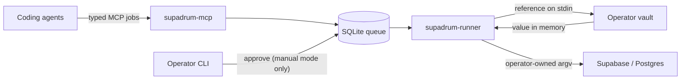

# Supadrum

Supadrum is a small credential broker for coding agents that operate Supabase
projects. Agents declare a project and an atomic intent; the runner owns
credentials, chamber rotation, execution, and verification. By default it does
not add a second human decision gate after a capability has been granted.

No resolved credential—and no `vault://` reference—enters a job payload or the
durable queue.

## Why Supadrum keeps secrets out of LLM context

Supadrum is local-first and open source. There is no hosted Supadrum secret
service and no telemetry path that sends credential material to the project
maintainers. The implementation and its security boundaries can be audited
directly in this repository.

When using the bundled macOS flow:

- the operator enters each value through a masked local TTY;
- the CLI writes it to
  [macOS Keychain](https://support.apple.com/guide/security/keychain-data-protection-secb0694df1a/web),
  an encrypted database protected by operating-system access controls;
- project configuration contains only `vault://` references;
- Supadrum never places resolved credential values in MCP messages or LLM
  prompts; agents receive project aliases, capabilities, job state, and
  redacted results;
- secret values do not enter job payloads, SQLite, the repository, argv, shell
  history, or CLI output;
- the runner resolves credentials in local process memory only when executing
  an operator-authorized command, then redacts exact values from captured
  stdout and stderr.

This removes standing plaintext credentials from the project directory and
reduces accidental exposure compared with a repo-local `.env`, especially when
coding agents can read workspace files.

This is a Supadrum data-flow guarantee, not a sandbox guarantee. An agent or
other process with unrestricted shell access running as the same macOS user
shares that user's Keychain security boundary and may be able to invoke local
credential tooling directly. Hard isolation requires running the broker under
a dedicated OS identity that the agent cannot access, or using an external
vault with independently enforced identity and policy. Open source is an
auditability benefit, not a security guarantee. See
[`SECURITY.md`](SECURITY.md) for the full threat model.



## What works

- Complete project credential bundles: secret key, Management API token, and
  PostgreSQL access.
- Capability gates for Data API, Auth Admin, Storage, Realtime, Edge Functions,
  secrets, migrations, schema inspection, SQL, and project management.
- Durable FIFO jobs with idempotency, event cursors, optional manual approvals,
  cancellation, verification, and expired-lease recovery.
- FIFO skipping of `waiting_credentials` and `waiting_approval` jobs without
  reordering executable work.
- Chamber reuse for consecutive jobs on one project and
  `drain → unmount → mount` rotation on project changes.
- Interactive capability-scoped sessions with optional manual approval,
  heartbeat, TTL, and automatic release.
- A stdio MCP server with the nine tools from the original design.
- Safe `dry-run` execution and opt-in real command execution with output
  redaction and repository-SHA verification.
- A Codex plugin bundle with a mandatory Supadrum workflow skill.

Supadrum deliberately does not embed a second Supabase client or hard-code
deployment commands. In real mode, operators own exact argv templates in YAML.
This keeps agents away from both credentials and authentication decisions while
letting each team pin the CLI behavior it has validated.

## Requirements

- Node.js 22 or newer; Node.js 24 LTS is recommended.
- macOS Keychain for the lightweight local vault backend, or pinned
  installations of SOPS and age for the portable encrypted-file backend.
- An external vault CLI for other real deployments. It must accept one
  `vault://` reference on stdin and print only the resolved value on stdout.
- `supabase`, `psql`, or other executables used by your command templates.

## Quick start

```bash
npm install
npm run build
npm link

supadrum --help
supadrum demo
```

`project add` may be launched from any directory. Given only an alias, it looks
for a matching Git repository in the current directory, beside it, and under
the common `~/Documents`, `~/Developer`, and `~/Projects` roots. It discovers
the Supabase project ref from linked CLI metadata or an allow-listed public
Supabase URL. Conflicting refs stop registration instead of guessing.

The happy path is one command:

```bash
cd /path/to/supadrum
supadrum project add example-ios
```

If discovery is incomplete, the wizard asks only for the missing repository or
project ref. Flags make the same flow deterministic for scripts:

```bash
supadrum project add example-ios \
  --repo /absolute/path/to/example-ios \
  --project-ref abcdefghijklmnopqrst \
  --profile development \
  --yes
```

The wizard creates an owner-only (`0600`) dry-run config, records the absolute
repository as project SSOT, generates the complete credential references, and
checks which vault values are available without printing them. It also makes
the target repository Codex-ready:

- `.agents/skills/supadrum/` receives the bundled workflow skill;
- `.codex/config.toml` receives an owner-independent, repository-scoped
  `supadrum` MCP entry pointing at the absolute operator config;
- `AGENTS.md` receives a small managed block requiring Supadrum for every
  Supabase task;
- existing direct Supabase MCP entries are preserved but disabled.

These writes are idempotent and preserve unrelated Codex settings and agent
instructions. Start a new Codex task after registration so it discovers the
skill and MCP server. Use `--no-agent-setup` only when Codex is not the target
agent or its configuration is managed separately.

The default `development` profile enables Data API, Storage, Edge Functions,
migrations, schema inspection, and project inspection. Capability grants are
the authorization boundary; jobs run automatically unless the operator sets
`approval_mode: manual`.

Manage registered projects with:

```bash
supadrum project list
supadrum project setup example-ios
supadrum project inspect example-ios
supadrum project credentials set example-ios
supadrum project credentials set example-ios --replace database_access
supadrum project migrations owner example-ios
supadrum project migrations driver example-ios prisma
supadrum project live example-ios
supadrum project dry-run example-ios
supadrum project doctor --all
```

`supadrum project setup <alias>` also installs or repairs the Codex agent
configuration by default. Pass `--no-agent-setup` to leave the repository
untouched.

Configuration lookup is, in order: `--config`, `SUPADRUM_CONFIG`, a local
`supadrum.yml`, a local `.supadrum/config.yml`, then
`$XDG_CONFIG_HOME/supadrum/config.yml` or
`~/.config/supadrum/config.yml`. `supadrum init` remains available for manual
configuration and also writes mode `0600`.

Start both processes; they use the same configuration discovery:

```bash
supadrum-runner
supadrum-mcp
```

For repositories registered through `project add/setup`, Codex starts
`supadrum-mcp` from the generated project configuration. The standalone
[`examples/mcp.json`](examples/mcp.json) remains available for other MCP
clients.

## Vault backends

Supadrum ships two open-source resolver paths. Agents use neither directly:
only the runner invokes the configured resolver.

For local macOS development, complete a registered project's credential bundle
through masked prompts:

```bash
supadrum project credentials set example
supadrum project doctor example
```

The command asks only for missing values, validates database access as a
complete PostgreSQL URI, writes each one directly to Keychain, and verifies the
round trip. `--replace` deliberately rotates one existing entry. Values never
enter argv, shell history, config, or CLI output.

For deliberate non-interactive automation, `keychain put` still accepts one
value on stdin:

```bash
printf '%s' "$VALUE" |
  supadrum-vault keychain put vault://supabase/example/management

vault_command: [supadrum-vault, keychain, resolve]
```

`keychain put` prints reference metadata only. The value is encoded in process
memory and sent to macOS `security -i` over stdin, never argv or shell history.

For a portable encrypted file, bootstrap an age identity into Keychain:

```bash
supadrum-vault sops bootstrap-age
```

The command prints only the public recipient. Resolve a SOPS bundle with:

```yaml
vault_command:
  - supadrum-vault
  - sops
  - resolve
  - --file
  - /absolute/path/to/secrets.enc.json
```

See [`examples/sops-age`](examples/sops-age/README.md) for setup and threat
model details. SOPS and age are operator-installed tools, not npm
dependencies. OpenBao, Infisical, and other vaults remain compatible through
the same stdin/stdout resolver contract.

For initial ingestion, `supadrum-vault migrate dotenv` copies only explicit
`--map NAME=vault://reference` entries to Keychain and a verified SOPS backup.
It previews by default; `--apply` atomically removes those plaintext
assignments after every round-trip succeeds.

## MCP surface

```text
projects.list()
projects.inspect(project)

jobs.submit(project, operation, payload, repo_sha, idempotency_key)
jobs.wait(job_id, cursor, timeout_ms)
jobs.status(job_id)
jobs.cancel(job_id)

sessions.open(project, capability, repo_sha, idempotency_key, ttl_ms)
sessions.exec(session_id, operation, payload, idempotency_key)
sessions.close(session_id)
```

The default `approval_mode: automatic` queues authorized jobs immediately.
Operators who explicitly set `approval_mode: manual` add a human gate to
mutating jobs. Approval intentionally does not exist in MCP:

```bash
supadrum approve <job-id> --actor operator --config ./supadrum.yml
```

Then the agent resumes `jobs.wait` from its last cursor.

### Coded errors

Anything a caller can provoke comes back as a tool error carrying a code, so
an agent can tell a denial from a not-yet:

```json
{
  "error": {
    "code": "session_not_active",
    "message": "Session is not active: 0f0c…",
    "retryable": true
  }
}
```

`retryable` is true only when repeating the identical call could succeed
without the caller changing anything — today that means `session_not_active`,
where the lease exists but its open job has not been granted yet. Every other
code asks the caller to do something different: `unknown_project`,
`unknown_job`, `unknown_session`, `capability_denied`,
`approval_not_required`, `invalid_input`, `idempotency_conflict`,
`job_state_conflict`, `session_state_conflict`.

`internal_invariant` is the exception that is nobody's fault but the broker's
— it means Supadrum rejected its own state transition, and retrying will not
help. A failure with no code at all is a crash, not a protocol answer.

### Read-only schema contracts

`schema.inspect` lets an agent verify exact database requirements without
supplying SQL or receiving PostgreSQL credentials. It has its own
`schema-inspection` capability and never requires approval:

```json
{
  "project": "example-ios",
  "operation": "schema.inspect",
  "payload": {
    "checks": [
      {
        "kind": "migration",
        "version": "20260729164000"
      },
      {
        "kind": "relation",
        "schema": "public",
        "name": "games"
      },
      {
        "kind": "column",
        "schema": "public",
        "relation": "games",
        "name": "played_at"
      },
      {
        "kind": "trigger",
        "schema": "public",
        "relation": "games",
        "name": "games_updated_at"
      },
      {
        "kind": "routine",
        "schema": "public",
        "name": "create_game_for_user",
        "argument_types": ["uuid", "uuid"]
      }
    ]
  },
  "repo_sha": "abc123",
  "idempotency_key": "example-ios:abc123:schema-contract-v1"
}
```

The same operation can certify structural RLS state and effective privileges:

```json
{
  "checks": [
    {
      "kind": "row-security",
      "schema": "public",
      "relation": "templates",
      "enabled": true,
      "force": false,
      "roles_without_bypass": ["anon", "authenticated"]
    },
    {
      "kind": "policy",
      "schema": "public",
      "relation": "templates",
      "name": "templates_update",
      "command": "UPDATE",
      "roles": ["authenticated"],
      "permissive": true
    },
    {
      "kind": "schema-privilege",
      "schema": "private",
      "role": "authenticated",
      "privilege": "USAGE",
      "granted": true
    },
    {
      "kind": "relation-privilege",
      "schema": "public",
      "relation": "templates",
      "role": "anon",
      "privilege": "SELECT",
      "granted": false
    },
    {
      "kind": "routine-privilege",
      "schema": "private",
      "name": "is_organization_member",
      "argument_types": ["text"],
      "role": "authenticated",
      "privilege": "EXECUTE",
      "granted": true
    }
  ]
}
```

`row-security` compares `ENABLE` and `FORCE` independently and rejects requested
roles that are missing, superusers, or carry `BYPASSRLS`. `policy` matches the
exact command, role set, permissive/restrictive mode, and the command-aware
presence of `USING` and `WITH CHECK`; it never returns expression bodies.

Privilege checks use PostgreSQL's effective privilege predicates, so inherited
and `PUBLIC` grants are included. Supported schema privileges are `USAGE` and
`CREATE`; relation privileges are `SELECT`, `INSERT`, `UPDATE`, `DELETE`,
`TRUNCATE`, `REFERENCES`, `TRIGGER`, and `MAINTAIN`; routine privileges support
`EXECUTE`. `MAINTAIN` requires PostgreSQL 17 or later, so verify the target
server version before requesting it. A negative requirement uses
`"granted": false`.

The runner verifies the requested repository SHA before database access and
executes only built-in, parameterized catalog queries in read-only
transactions. Routine checks match PostgreSQL functions (`prokind = 'f'`),
which is the object kind exposed as a Supabase RPC; procedures and aggregates
do not satisfy them.

Requests contain 1–100 checks. Their serialized JSON is limited to 64 KiB,
PostgreSQL identifiers to 63 UTF-8 bytes, and routine signatures to 64
arguments of at most 255 UTF-8 bytes each. A completed result with
`compatible: false` means one or more submitted requirements are unsatisfied.
That can mean a missing object or role, a structural mismatch, or an effective
privilege different from the requested value. It is not an execution failure,
and `compatible` applies only to the submitted checks; it does not claim that
the whole repository and remote schema are identical. Policy checks certify
structure, not the business correctness of predicates. That requires separate
tests with real identities.

## Job states

```text
queued
waiting_credentials
waiting_approval
granted
running
verifying
completed
failed
cancelled
lease_expired
```

Only `completed` means success.

`waiting_approval` is used by explicit `approval_mode: manual` deployments and
by jobs persisted before an operator switched to automatic mode. An automatic
runner records `approved_by: policy:automatic` while reconciling those legacy
jobs, then continues normal execution.

## Configuration

Start from [`examples/supadrum.yml`](examples/supadrum.yml). Physical Supabase
backends are chambers; logical applications point to them:

```yaml
approval_mode: automatic

chambers:
  example-platform:
    project_ref: abcdefghijklmnopqrst
    credentials:
      secret_key: vault://supabase/example-platform/secret
      management_token: vault://supabase/example-platform/management
      database_access: vault://supabase/example-platform/postgres

projects:
  example-web:
    repo: /absolute/path/to/example-web
    chamber: example-platform
    mode: live
    migrations: owner
    migration_driver: prisma
    capabilities:
      - migrations
      - schema-inspection

  example-ios:
    repo: /absolute/path/to/example-ios
    chamber: example-platform
    mode: live
    migrations: consumer
    capabilities:
      - data-api
      - edge-functions
      - schema-inspection
```

Projects default to `dry-run`; `supadrum project live <alias>` validates the
repository and credential bundle before enabling only that alias. Consecutive
aliases on one chamber reuse its mounted credentials. A different chamber
causes drain and rotation. The global FIFO still grants only one job at a time.

Credential-free local chambers may grant `auth-admin` in addition to
`migrations`. The supported local action resets one active SNAP password
credential to the public development profile without putting a password or
hash in the queued payload:

```json
{
  "action": "reset-password",
  "adapter": "snap-password",
  "email": "developer@example.test",
  "profile": "local-development"
}
```

The `local-development` profile is local-only and maps to the documented test
password `TestPassword1234`. The operation requires a loopback database,
updates exactly one password credential, clears login lockout state, and aborts
the transaction when the account is missing or ambiguous.

`{"action":"inspect-organizations","adapter":"snap-auth"}` performs a
read-only local inspection returning only organization id, name, slug,
onboarding state, and product/document-ingest counts.

Auth Admin can also recreate or reactivate the test user in the known local
`SNAP Dev` tenant, mark that tenant ready for application access, attach the
user as owner, reset the same public development password, and revoke stale
sessions:

```json
{
  "action": "recreate-test-user",
  "adapter": "snap-password",
  "email": "test@materic.dev",
  "profile": "local-development",
  "organization": "snap-dev-ready"
}
```

The transaction fails closed when the known seed tenant is absent, so the
broker never guesses a tenant.

`migration_driver` accepts `supabase` or `prisma` and defaults to `supabase`
for backward compatibility. The Supabase driver plans with
`supabase db push --dry-run --linked` and applies with
`supabase db push --linked --yes`. The Prisma driver plans with
`prisma migrate status`, applies versioned production migrations with
`prisma migrate deploy`, and inspects `public._prisma_migrations`. Prisma is
resolved from the repository's installed `node_modules/.bin` first, then from
the runner `PATH`. Supadrum passes the vault-resolved `DATABASE_URL` and
`DIRECT_DATABASE_URL` only through the child environment and redacts both the
URI and its decoded password from captured output. A Prisma plan with pending
migrations completes successfully with `pending_migrations: true`; connection,
history-divergence, and failed-migration errors still fail closed.

Existing Prisma databases can establish migration history through the
`migration.baseline` operation. In manual mode it is approval-gated. Its
payload is an explicit contiguous prefix of `prisma/migrations`:

```json
{
  "migrations": [
    "20260101090000_init",
    "20260101100000_enable_rls"
  ]
}
```

Every requested `migration.sql` must be tracked and clean at the submitted
repository commit. Supadrum resolves that SHA once to its complete commit OID,
uses the same OID for HEAD, tree, and blob checks, and compares Prisma history
name, order, completion state, and checksum. It invokes only
`prisma migrate resolve --applied <name>` for the missing suffix and verifies
history after every command. A failed, incomplete, rolled-back, unexpected,
out-of-order, or checksum-mismatched row fails closed. Retrying rereads durable
history and skips only an already completed contiguous prefix.

`migration.baseline` is Prisma-only and migration-owner-only. It records the
submitting agent's assertion that existing schema matches the prefix; it does
not infer or repair schema compatibility and it has no direct CLI bypass.

Live operations use built-in typed adapters for project inspection, migration
planning/application, catalog-only schema inspection, Function deployment,
operator-mapped Function Secrets, and digest-pinned repository SQL files.
Agents cannot supply arbitrary shell commands. The database URI and derived
password are passed through environment only, never argv.

## Security model

- Project YAML is operator-owned policy, not agent input.
- MCP schemas reject sensitive payload keys, PostgreSQL URLs, and vault
  references.
- The vault resolver receives references over stdin, not argv.
- Resolved values exist only in runner memory and child-process environment.
- The SOPS age private identity remains in Keychain and enters only the SOPS
  child environment.
- Persisted stdout and stderr are redacted with all resolved values.
- Automatic mode treats configured capabilities as the authorization decision;
  manual approvals remain available only through the operator CLI.
- Sessions lease exactly one capability and block the global queue until close
  or expiry.
- The safe default has zero external effects.

Read [`SECURITY.md`](SECURITY.md) before enabling live mode.

## Development

```bash
npm run check
npm run build
npm run smoke
npm pack --dry-run
```

The test suite uses temporary SQLite databases and never contacts Supabase.

## License

Apache-2.0. See [`LICENSE`](LICENSE).
